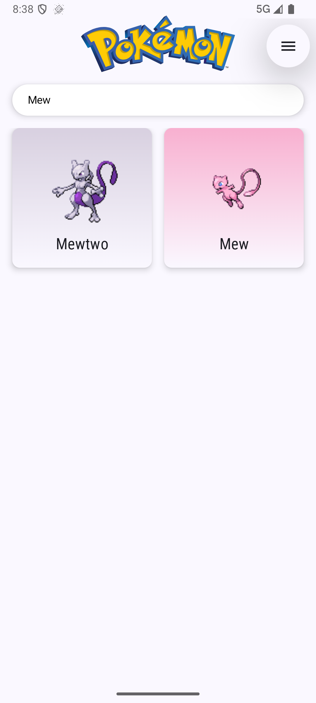

# Jetpack Compose Pokedex

A modern Android application built with Jetpack Compose, demonstrating best practices in UI,
architecture, dependency injection, and network data handling. This project fetches and displays
Pokémon data from the [PokeAPI](https://pokeapi.co/), providing a visually rich and interactive
Pokedex experience.

---

## Table of Contents

- [Features](#features)
- [Screenshots](#screenshots)
- [Architecture](#architecture)
- [Tech Stack & Dependencies](#tech-stack--dependencies)
- [Project Structure](#project-structure)
- [How It Works](#how-it-works)
- [Getting Started](#getting-started)
- [Learning Outcomes](#learning-outcomes)
- [Contributing](#contributing)

---

## Features

- **Modern UI**: Built entirely with Jetpack Compose and Material 3.
- **Pokémon List**: Paginated, searchable list of Pokémon with images and dominant color
  backgrounds.
- **Detail Screen**: Rich Pokémon details including stats, types, images, and animated stat bars.
- **Navigation**: Seamless navigation using Navigation Compose.
- **Dependency Injection**: Powered by Hilt for scalable and testable code.
- **Network Layer**: Retrofit and OkHttp for robust API communication.
- **Image Loading**: Coil for efficient image loading and caching.
- **Palette Extraction**: Uses Palette API to extract dominant colors from Pokémon images.
- **Logging**: Timber for structured logging.
- **Theming**: Light and dark themes with dynamic color support on Android 12+.

---

## Screenshots

<p align="center">
  
  
  
</p>

<p align="center">
  
  
</p>

---

## Architecture

This project follows a layered, modular architecture:

- **UI Layer**: Jetpack Compose screens and components.
- **ViewModel Layer**: State management using `ViewModel` and `State`.
- **Repository Layer**: Abstracts data sources and business logic.
- **Data Layer**: Retrofit API interfaces and data models.
- **Dependency Injection**: Hilt modules for providing dependencies.

---

## Tech Stack & Dependencies

- **Kotlin**: Modern, concise, and safe programming language.
- **Jetpack Compose**: Declarative UI toolkit for Android.
- **Material 3**: Latest Material Design components.
- **Navigation Compose**: Navigation for Compose.
- **Hilt**: Dependency injection.
- **Retrofit**: Type-safe HTTP client.
- **OkHttp**: HTTP & HTTP/2 client.
- **Coil**: Image loading for Compose.
- **Palette API**: Extracts prominent colors from images.
- **Timber**: Logging utility.
- **Coroutines**: Asynchronous programming.
- **JUnit**: Unit testing.

See [gradle/libs.versions.toml](gradle/libs.versions.toml) for exact versions.

---

## Project Structure

```
app/
├── src/
│   ├── main/
│   │   ├── java/com/example/pokedex/
│   │   │   ├── data/         # Data sources, models, repositories
│   │   │   ├── domain/       # Use cases, business logic
│   │   │   ├── ui/           # Compose UI, screens, navigation
│   │   │   └── di/           # Dependency injection setup
│   │   └── res/              # Resources (drawables, layouts, etc.)
│   └── test/                 # Unit and UI tests
├── build.gradle
└── ...
```

---

## How It Works

1. **App Startup**:

   - `PokedexApplication` initializes Timber logging and Hilt.
   - `MainActivity` sets up the Compose UI and navigation.

2. **Pokémon List**:

   - `PokemonListScreen` displays a paginated list of Pokémon.
   - Uses `PokemonListViewModel` to fetch data from `PokemonRepository`.
   - Each entry shows the Pokémon's image and name, with a background color extracted using the
     Palette API.

3. **Detail Screen**:

   - Tapping a Pokémon navigates to `PokemonDetailScreen`.
   - Fetches detailed data via `PokemonDetailViewModel`.
   - Displays images, types, stats (with animated bars), and other info.

4. **Networking**:

   - `PokemonRepository` uses Retrofit to fetch data from PokeAPI.
   - Responses are mapped to Kotlin data classes.

5. **Dependency Injection**:

   - All dependencies (API, repository) are provided via Hilt modules in `di/AppModule.kt`.

6. **Image Loading**:

   - Coil loads images asynchronously and efficiently.

7. **Theming**:
   - Light/dark themes and dynamic color support are handled in `ui/theme/Theme.kt`.

---

## Getting Started

### Prerequisites

- Android Studio Giraffe or newer
- JDK 11+
- Internet connection (for API access)

### Setup

1. **Clone the repository:**

   ```sh
   git clone https://github.com/yourusername/jetpack-compose-pokedex.git
   cd jetpack-compose-pokedex
   ```

2. **Open in Android Studio**

   Open the project folder.

3. **Build the project**

   Let Gradle sync and download dependencies.

4. **Run the app**

   Select an emulator or device and click "Run".

## Learning Outcomes

This project is a great resource for learning:

- Jetpack Compose: Building modern, declarative UIs.
- MVVM Architecture: Clean separation of concerns.
- Dependency Injection with Hilt: Scalable and testable code.
- Retrofit & OkHttp: Robust networking in Android.
- Coil: Efficient image loading in Compose.
- Palette API: Dynamic theming based on image content.
- State Management: Using Compose's state APIs.
- Navigation: Implementing navigation in Compose.
- Material 3 Theming: Customizing and supporting dark/light/- dynamic themes.
- Best Practices: Clean code, modularization, and testability.

## Contributing

Contributions are welcome! Please open issues or submit pull requests for improvements or bug fixes.
